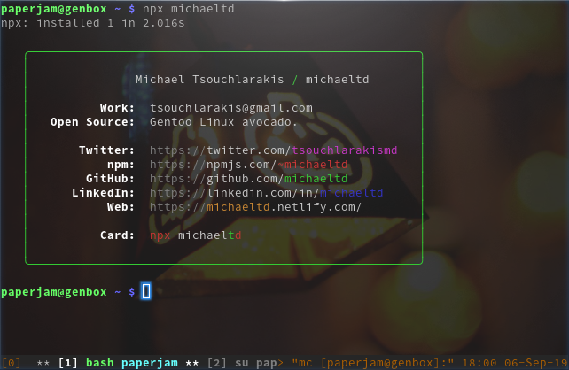

It's me, Michael,
    Thank you, Tierney!

# Usage
Via npx:
```
npx michaeltd
```


Not including how to use it globally because I'm not sure why you'd want this as a global command. That'd be creepy.